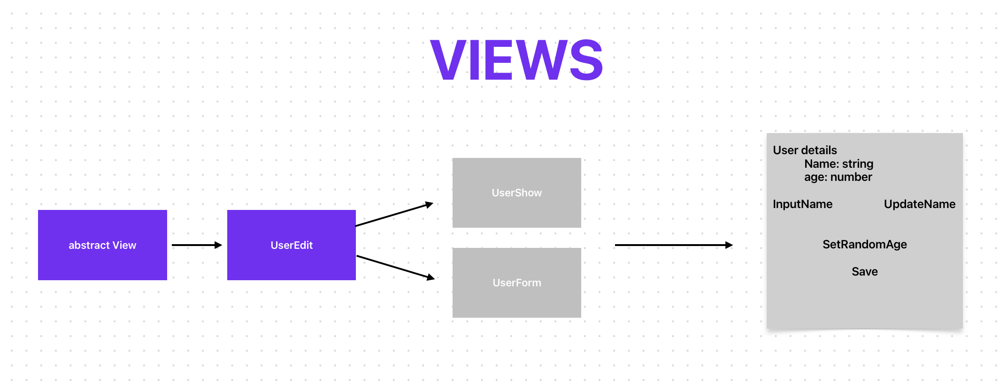

# Web Framework

In this repo, I create a client-side Framework similar to React, Vue, Angular or ... Maybe It's not gonna have the same functionality but It has a same purpose. It's going to fetch some data, render some content on web page and handle user events whenever user like messes with something.

# Composition approach - Models

# Inheritance approach - Models

# View Classes

# Wrapup
